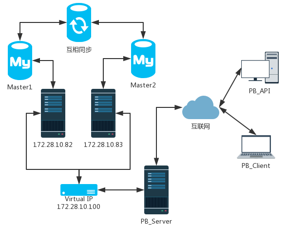

##  一、结构

1. 简介：  
系统主要通过Keepalived+MySQL双主来实现MySQL-HA，我们必须保证两台MySQL数据库的数据完全一样，基本设计是两台MySQL互为主从关系，通过Keepalived配置虚拟IP，实现当其中的一台MySQL数据库宕机后，应用能够自动切换到另外一台MySQL数据库，保证系统的高可用。   

2. 拓扑环境：  
    - OS: Red Hat Enterprise Linux Server release 7.1 (Maipo)  

    - MySQL version: 5.5.59-log MySQL Community Server (GPL)  

    - Keepalived version: keepalived-1.3.5-1.el7.x86_64  

    - MySQL-Vip: 172.28.10.100  

    - MySQL-Master1: 172.28.10.82  

    - MySQL-Master2: 172.28.10.83  

3. 结构图：  



## 二、 MySQL环境部署

1. 修改MySQL配置文件  
    以下为master1数据库的my.cnf配置文件内容，目录为/etc/my.cnf，配置完成后重启数据库  

    ```conf

    [client]

    port		= 3382

    socket		= /var/lib/mysql/mysql.sock

    

    [mysqld]

    port		= 3382

    socket		= /var/lib/mysql/mysql.sock

    skip-external-locking

    key_buffer_size = 16M

    max_allowed_packet = 1M

    table_open_cache = 64

    sort_buffer_size = 512K

    net_buffer_length = 8K

    read_buffer_size = 256K

    read_rnd_buffer_size = 512K

    myisam_sort_buffer_size = 8M

    log-bin=mysql-bin

    binlog_format=mixed

    # master2的server-id改为2

    server-id	= 1

    # 要产生log的数据库

    binlog-do-db=pms_db

    # 不产生log的数据库

    binlog-ignore-db=mysql

    # 要复制的数据库

    replicate-do-db=pms_db

    # 不复制的数据库

    replicate-ignore-db=mysql

    log-bin=mysql-bin

    innodb_data_home_dir = /var/lib/mysql

    innodb_data_file_path = ibdata1:10M:autoextend

    innodb_log_group_home_dir = /var/lib/mysql

    innodb_buffer_pool_size = 16M

    innodb_additional_mem_pool_size = 2M

    innodb_log_file_size = 5M

    innodb_log_buffer_size = 8M

    innodb_flush_log_at_trx_commit = 1

    innodb_lock_wait_timeout = 50

    

    [mysqldump]

    quick

    max_allowed_packet = 16M

    

    [mysql]

    no-auto-rehash

    

    [myisamchk]

    key_buffer_size = 20M

    sort_buffer_size = 20M

    read_buffer = 2M

    write_buffer = 2M

    

    [mysqlhotcopy]

    interactive-timeout

    ```


2. 将master1设置为master2的主服务器
    - 创建用于同步数据的账户及赋予权限、限制登录IP  

    ```sql

    -- master1上操作

    create user 'backup'@'172.28.10.83' identified by 'pms@1082';

    grant replication slave on *.* to 'backup'@'172.28.10.83' identified by 'pms@1082';

    -- master2上稍后操作

    create user 'backup'@'172.28.10.82' identified by 'pms@1083';

    grant replication slave on *.* to 'backup'@'172.28.10.82' identified by 'pms@1083';

    ```

    - master1上操作

    ```sql

    show master status;

    -- 执行后显示file和position，显示如下

    +------------------+----------+--------------+------------------+

    | File             | Position | Binlog_Do_DB | Binlog_Ignore_DB |

    +------------------+----------+--------------+------------------+

    | mysql-bin.000010 |      107 | pms_db       | mysql            |

    +------------------+----------+--------------+------------------+

    ```

    - master2上操作

    ```sql

    -- master_log_file、master_log_pos根据上面master1的信息填写

    change master to master_host='172.28.10.82', master_user='backup', master_password='pms@1082', master_log_file='mysql-bin.000010', master_log_pos=107, master_port=3382;

    start slave;

    show slave status \G

    -- 打印的信息中数值为下面的值即为配置成功

    Slave_IO_Running: Yes

    Slave_SQL_Running: Yes    

    ```

3. 将master2设置为master2的主服务器  
    按照上一部分重复即可

## 三、 Keepalived的安装配置

1. 安装

    ```bash

    # 两台机器分别执行，可选rpm、源码安装，依赖问题根据实际情况解决

    yum install keepalived 

    ```

2. 配置

    - master1配置，==router_id、priority、real_server==与master2不同，==interface==根据实际情况修改，配置文件目录为/etc/keepalived/keepalived.conf

    ```conf

    ! Configuration File for keepalived

    global_defs {

        router_id MYSQL-82

        vrrp_skip_check_adv_addr

        vrrp_garp_interval 0

        vrrp_gna_interval 0

    }

    

    vrrp_instance VI_1 {

        state BACKUP

        interface eth0

        virtual_router_id 51

        priority 100

        nopreempt

        advert_int 1

        authentication {

            auth_type PASS

            auth_pass 1111

        }

        virtual_ipaddress {

            172.28.10.100

        }

    }

    

    virtual_server 172.28.10.100 3382 {

        delay_loop 2

        lb_algo rr

        lb_kind DR

        persistence_timeout 50

        protocol TCP

    

        real_server 172.28.10.82 3382 {

            weight 1

                    notify_down /etc/keepalived/mysql.sh

                    TCP_CHECK {

                            connect_timeout 3

                            delay_before_retry 3

                            connect_port 3382

                    }

        }

    }

    ```

    - master2配置，router_id、priority、real_server与master1不同，interface根据实际情况修改

    ```conf

    ! Configuration File for keepalived

    global_defs {

        router_id MYSQL-83

        vrrp_skip_check_adv_addr

        vrrp_garp_interval 0

        vrrp_gna_interval 0

    }

    

    vrrp_instance VI_1 {

        state BACKUP

        interface eth0

        virtual_router_id 51

        priority 50

        advert_int 1

        authentication {

            auth_type PASS

            auth_pass 1111

        }

        virtual_ipaddress {

            172.28.10.100

        }

    }

    

    virtual_server 172.28.10.100 3382 {

        delay_loop 2

        lb_algo rr

        lb_kind DR

        persistence_timeout 50

        protocol TCP

    

        real_server 172.28.10.83 3382 {

            weight 1

            notify_down /etc/keepalived/mysql.sh

            TCP_CHECK {

                    connect_timeout 3

                    delay_before_retry 3

                    connect_port 3382

            }

        }

    }

    ```

    - mysql.sh脚本，需chmod添加执行权限

    ```bash
    #!/bin/bash

    pkill keepalived

    /sbin/ifdown eth0 && /sbin/ifup eth0

    ```

    - 启动及检查

    ```bash

    systemctl start keepalived

    systemctl status keepalived

    systemctl stop keepalived

    # 查看网络信息

    ip a

    # 查询以下信息证明 Virtual IP已经绑定成功

    eth0: <BROADCAST,MULTICAST,UP,LOWER_UP> mtu 1500 qdisc mq state UP qlen 1000

    link/ether 00:50:56:b1:60:58 brd ff:ff:ff:ff:ff:ff

    inet 172.28.10.83/24 brd 172.28.10.255 scope global eth0

       valid_lft forever preferred_lft forever

    inet 172.28.10.100/32 scope global eth0

       valid_lft forever preferred_lft forever

    inet6 fe80::250:56ff:feb1:6058/64 scope link 

       valid_lft forever preferred_lft forever

    ```